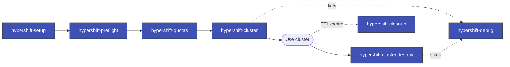

> Follow this diagram as the workflow.

# HyperShift Skills

Skills for managing HyperShift (hosted OpenShift) clusters on AWS. This is the
index; each stage below is a standalone skill you invoke directly. Install them
together with the `hypershift` plugin (see below).

## Sub-Skills

| Skill | Description |
|-------|-------------|
| `hypershift-setup` | Set up the local environment (hcp CLI, ansible collections, credentials) |
| `hypershift-preflight` | Run pre-flight checks before setup or cluster creation |
| `hypershift-quotas` | Check AWS service quotas and usage; plan parallel capacity |
| `hypershift-cluster` | Create and destroy clusters; **owns the shared scripts** |
| `hypershift-debug` | Debug AWS resources for stuck or orphaned clusters |
| `hypershift-cleanup` | TTL/label-based auto-cleanup of stale clusters |

All the shell scripts these skills reference live in
`hypershift-cluster/scripts/` (co-located so their sibling cross-calls keep
working). Sub-skills point at that directory via relative paths such as
`../hypershift-cluster/scripts/preflight-check.sh`.

## Installation

```
/plugin marketplace add rossoctl/agent-skills
/plugin install hypershift@rossoctl-agent-skills
```

This installs all six sub-skills as one bundle.

## Quick Start

```bash
# 1. From your working directory, source the credentials env file
#    (see hypershift-setup for its structure)
source .env.rossoctl-hypershift-custom

# 2. Verify prerequisites
../hypershift-cluster/scripts/preflight-check.sh

# 3. Create a cluster (name suffix max 5 chars — AWS IAM limit)
../hypershift-cluster/scripts/create-cluster.sh pr529

# 4. Destroy the cluster when done
../hypershift-cluster/scripts/destroy-cluster.sh pr529
```

## First-Time Setup (credentials)

```bash
# Run preflight check
../hypershift-cluster/scripts/preflight-check.sh

# Set up credentials (requires IAM admin)
../hypershift-cluster/scripts/setup-hypershift-ci-credentials.sh

# Set up local tools
../hypershift-cluster/scripts/local-setup.sh
```

## Prerequisites

- AWS CLI with admin credentials
- OpenShift CLI (`oc`) logged into the management cluster
- Ansible (`pip install ansible-core`)
- `jq`

See each sub-skill's `SKILL.md` for stage-specific detail.
